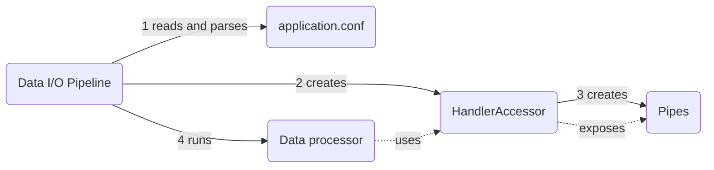

# Main Concepts
<details open markdown="block">
  <summary>
    Table of contents
  </summary>
  {: .text-delta }
1. TOC
{:toc}
</details>

--- 
This page provides an overview of the key aspects that form the foundation of the Data I/O framework. Understanding these concepts is essential for effectively using the framework to design and implement your data processing pipelines.

## Building Blocks
### Pipeline

The **pipeline** is the central component of the Data I/O framework. It is responsible for instantiating the components
defined in the configuration and running the **processor**. You can easily define and configure your **pipeline** using
the provided configuration file, allowing you to focus on the essential task of data transformation.

For more information about how to configure your applications, visit the [configuration page](configuration/configuration.html).

### Pipes

**Pipes** are the fundamental components of the Data I/O framework, representing the sources and destinations of data
within the pipeline. **Inputs** handle the reading of data from various sources, while **outputs** handle the writing of
transformed data to different destinations. By configuring inputs and outputs in the provided configuration file, you
can define the specific data sources and destinations for your ETL pipelines. Data I/O provides flexible and extensible
options for handling various file formats, databases, and streaming data sources.

In your code, pipes are closely related to Spark's reading and writing capabilities. When configuring your application,
you'll specify the source or destination of your data, and Data I/O will use Spark's underlying APIs to perform the
actual reading and writing.

No matter where data comes from or goes, each input pipe returns a DataFrame and each output pipe receives a DataFrame
to write.
{: .important}

### HandlerAccessor

The `HandlerAccessor` plays a crucial role in the pipeline by providing access to different handlers responsible for
interacting with **pipes**. Indeed, through the `HandlerAccessor`, you can access the input/output handlers, enabling
seamless integration and interaction with the corresponding components defined in your configuration file.

The `HandlerAccessor` is injected in the run method of your **processor**.
```scala
case class MyDataProcessor() extends Processor {
  def run(handlers: HandlerAccessor)(spark: SparkSession) = {
    // Read, transform and write
  }
}
```

### Processors
**Processors** play a vital role in the Data IO framework by encapsulating the data transformation logic within the pipeline. A **processor** is a custom class that you define to implement the specific data processing steps required for your ETL pipelines. It represents a single stage or operation in the pipeline and is responsible for manipulating the data according to your business requirements.

When the pipeline is executed, the run method of the **Processor** is executed, which contains the custom transformation
logic. Inside, you can access and manipulate the data using the provided `HandlerAccessor`, which provides access to the
InputHandler and OutputHandler.

Inside your **Processor**, you can easily modularize and organize your data transformation steps, making the pipeline
more testable and maintainable. Each function in the **processor** can be designed to handle a specific data processing
task, such as cleaning, aggregating, joining, or any other required transformations.

```scala
case class MyDataProcessor() extends Processor {
  override def run(handlers: HandlerAccessor)(implicit spark: SparkSession): Unit = {
    // Access input data
    val inputData: DataFrame = handlers.input.read("my-input")
    // Perform data transformation
    val transformedData: DataFrame = transformData(inputData)
    // Write transformed data to output
    handlers.output.write("my-output", transformedData)
  }

  private def transformData(inputData: DataFrame): DataFrame = {
    // Your custom data transformation logic here
    // Example: Perform data cleansing, filtering, or aggregations
    // Return the transformed DataFrame
    ...
  }
}
```

For a detailed guide about how to write processors for your applications, visit the [processors page](writing-processors.html).

--- 

## Lifecycle of a Data I/O application



When the application starts, the pipeline reads and parses the configuration file. From this, it triggers a series of instantiations that result in the creation of the HandlerAccessor.

Finally, the pipeline instantiates and runs the data processor, giving it the HandlerAccessor that it instantiated.